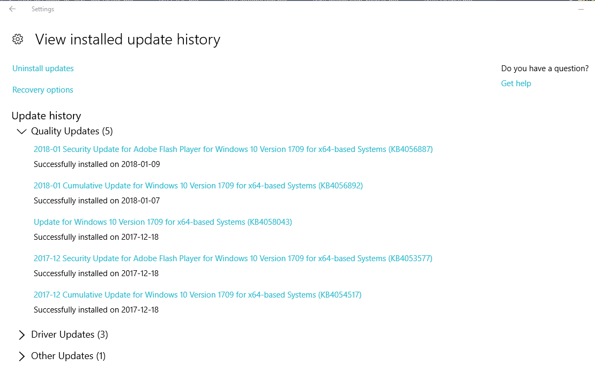
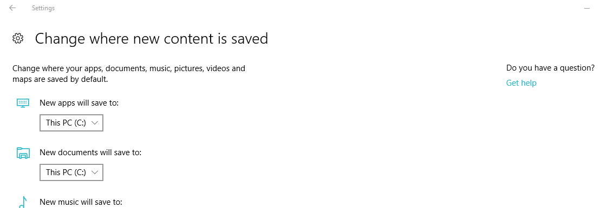

# Requirements
The minimum requirements for using Windows Subsystem for Linux are:
- Windows 10 Home, Professional or Enterprise (64-bit version only) with
Fall Creators Update (October 2017) or later installed, or
Windows Server 2016.
- All Windows updates must be installed. If some updates are stalled or
cannot be properly installed, you may not be able to enable WSL. A 
[section](#Checking-That-All-Windows-Updates-Are-Installed) is included 
below that describes how to check that all
updates are installed, and how to fix your system if they will not
install.
- Many GB of disk storage on your system drive (usually C:). WSL and
your Linux distros will 
only execute from your system drive. There are instructions below that
will show you [how to ensure that your distros will be installed on
your system drive](
#Ensuring-That-WSL-and-Distros-Run-From-System-Drive).
- You must have Administrator rights on your system.

## Checking That All Windows Updates Are Installed
To check the status of Windows updates, open Settings and select
*Update and Security* and if necessary, *Windows Update*. Select
*View installed update history*. Here is what my update history looks
like:

All updates should indicate *Successfully installed*. If any updates
say that a restart is required, then restart your system and check again.
If the updates still say that a restart is required, then there is
probably a problem with one or more of the udpates. For example, I had
one update that said it could not be downloaded. This download was
attempted the day after the update was apparently successfully installed.
All updates after that one were stuck with a status of restart required.
Something was obviously messed up on my system.

To solve any Windows udpate problems, you should follow the instructions
in the following section.
### How to Fix Windows Update Problems
The first step to fixing Windows update problems is to download and run
the [Windows Update Troubleshooter](
https://support.microsoft.com/en-ca/help/4027322/windows-update-troubleshooter).
Run the troubleshooter as Administrator. If any fixes are suggested,
apply those and try to update your system again.

If there are still Windows update problems, use [this guided 
walkthrough](https://support.microsoft.com/en-ca/help/10164). Step 7
fixed my problems.
## Ensuring That WSL and Distros Run From System Drive
If your computer is configured with only one active hard disk or 
solid-state drive, then you can ignore this section. If you have more
than one drive but have never
changed the drive that applications are loaded onto, then you can likely
also ignore this section.

To check, and change if necessary, the drive that applications are
installed to, open *Settings*. In *Find a setting*, enter **Default save 
locations** and press Enter. This displays the *Change where new content is
saved* page:

Note the location specified for *New apps will be saved to:*, and if
necessary, change this to the system drive, which is typically *C:*.
Close *Settings*.