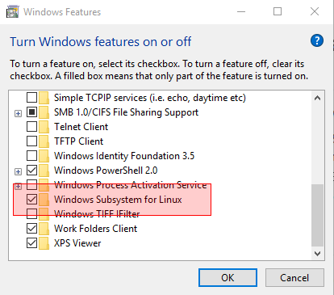
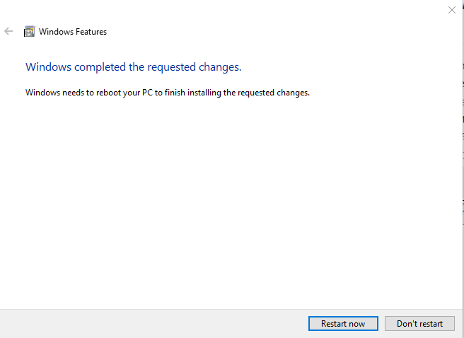

# Enabling Windows Subsystem for Linux
Windows Subsystem for Linux is an optional feature for Windows 10 and
Windows Server 2016 and later. Before you can install a Linux distro
and use it, you must first enable WSL within Windows. There are two
ways of doing this, both of which will be shown here.
## Enabling WSL using Powershell
Here are the steps for enabling WSL using Powershell[1]:

1. Start Powershell in Administrator mode.
2. Enter:
```
Enable-WindowsOptionalFeature -Online -FeatureName Microsoft-Windows-Subsystem-Linux
```
3. Rstart your computer when prompted.

If instead of prompting you to restart, it displays the following:
```
Enable-WindowsOptionalFeature : One or several parent features are disabled so current feature can not be enabled.
 At line:1 char:1
 + Enable-WindowsOptionalFeature -Online -FeatureName Microsoft-Windows- ...
 + ~~~~~~~~~~~~~~~~~~~~~~~~~~~~~~~~~~~~~~~~~~~~~~~~~~~~~~~~~~~~~~~~~~~~~
     + CategoryInfo          : NotSpecified: (:) [Enable-WindowsOptionalFeature], COMException
     + FullyQualifiedErrorId : Microsoft.Dism.Commands.EnableWindowsOptionalFeatureCommand
```
then you must go back to the [Requirements](0210-Requirements.md) page and 
check that ALL requirements are met. The most likely cause is a problem 
with Windows updates.[2]
## Enabling WSL Via Windows Optional Features
As an alternative to enabling WSL using Powershell, you can enable WSL
via the Windows optional features program. To start the program, press
*Win + R* or click the right mouse button on the Windows menu and select
*Run*. Type *optionalfeatures.exe* and press Enter. This opens the
Windows features application. Scroll down to *Windows Subsystem for Linux*
and select it:


Click *OK*. This displays:



Click *Restart now* to restart your system.

Unlike the Powershell method, there is no indication here that enabling
WSL did not work. The only way to check to is to start 
*optionalfeatures.exe* again to see if WSL is enabled. If *Windows 
Subsystem for Linux* is not selected, go back to the [Requirements](
0210-Requirements.md) page and check that ALL requirements are met.

## References
[1] [Windows 10 Installation Guide](
https://docs.microsoft.com/en-us/windows/wsl/install-win10)

[2] [Problems I Had Installing WSL](
https://jaipblog.wordpress.com/2017/12/26/problems-i-had-installing-wsl/)

[3] [How to: Enable the Windows Subsystem for Linux](
https://answers.microsoft.com/en-us/insider/forum/insider_wintp-insider_install/how-to-enable-the-windows-subsystem-for-linux/16e8f2e8-4a6a-4325-a89a-fd28c7841775?auth=1)
Note that most of this post is outdated, and therefore the instructions in
it should not be followed.