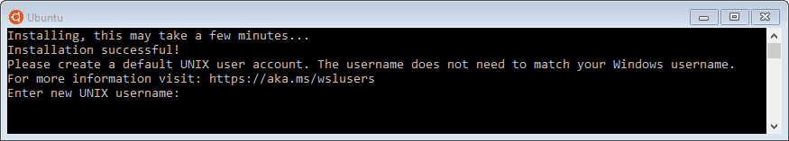
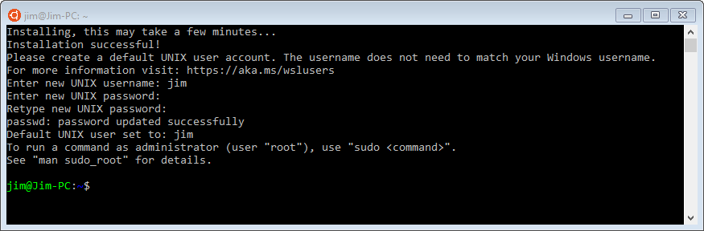

# Ubuntu
To install the Ubuntu distro, open Windows Store and enter
*Ubuntu* in the search box. Select *Ubuntu* from the
dropdown list. When the Ubuntu app page is displayed,
click on the *Install* button. Download will begin.
When the download is complete, the *Install* button
changes to *Launch*. Either click on that button,
or start *Ubuntu* from the Windows menu. Ubuntu will start
installing the application. After a few minutes, you
will be asked to enter a default UNIX user name:



You may enter any user name; it does not have to match
your Windows user name. Every time you start Ubuntu in the
future, it will start logged into that user account.

After you press enter, you will be asked for a new
password and then to repeat that password. This is the
password that will correspond to your new Ubuntu user
account.

Installation will complete, and your are presented with
a bash command prompt:



At this point, you should enter the following commands
to update any packages to the latest available for the
installed version of Ubuntu:

```
sudo apt update
sudo apt upgrade
sudo apt autoremove
```

The third command will remove any packages that are no
longer referenced by other packages; for Unbuntu
16.04 LTS. there is at least one such package.

You can now use any bash or external command, including
installing additional packages. See the
[Using WSL] chapter for more information on what you
can do.