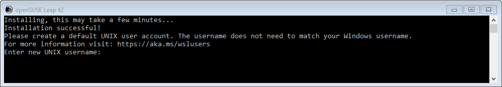

# OpenSUSE Leap
To install the OpenSUSE Leap distro, open Windows Store and enter
*openSUSE* in the search box. Select *OpenSUSE Leap 42* from the
dropdown list. When the OpenSUSE app page is displayed,
click on the *Install* button. Download will begin.
When the download is complete, the *Install* button
changes to *Launch*. Either click on that button,
or start *openSUSE Leap 42* from the Windows menu. OpenSUSE
will start
installing the application. After a few minutes, you
will be asked to enter a default UNIX user name:



You may enter any user name; it does not have to match
your Windows user name. Every time you start openSUSE in the
future, it will start logged in as the user you just entered.

After you press enter, you will be asked for a new
password and then to repeat that password. This is the
password that will correspond to your new OpenSUSE user
account.

You are then asked if you want to use the same password
for the root user. If you answer *yes*, installation will 
complete, and your are presented with
a bash command prompt:


If you answer *no*, you will be asked for a root password
and then to reenter the root password. You are then presented
with a bash command prompt.

At this point, you should enter the following command
to update any packages to the latest available for the
installed version of OpenSUSE Leap:

```
sudo zypper update
```

You can now use any bash or external command, including
installing additional packages. See the
[Using WSL] chapter for more information on what you
can do.