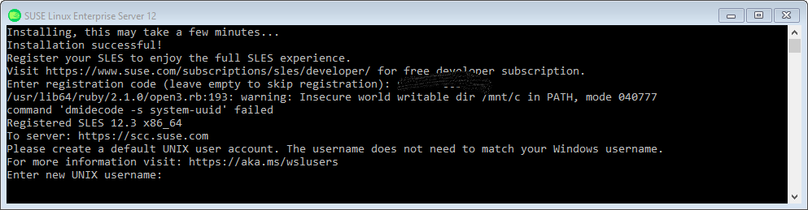
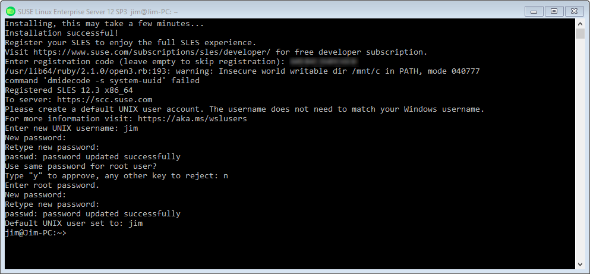

# SUSE Linux Entrerprise Server
To fully use SUSE Linux Enterprise Server (SLES), you must register for
a free developer subscription. Once you have registered, you
will be able to install updates and you will also receive 
security and other emails. To register, you must provide a
considerable amount of information:
- your name,
- your address,
- your company,
- your job title,
- your phone number, and
- your email address.

If you are not willing to provide all of this information, then
I suggest that you not install SUSE Linux Enterprise Server
because you should not run SLES without security and bug fix
updates.

To install the SUSE Linux Enterprise Server distro, open Windows
Store and enter
*sles* in the search box. Select *SUSE Linux Enterprise Server 12*
from the
dropdown list. When the *SUSE Linux Enterprise Server 12* app page 
is displayed,
click on the *Get* button or the *Install* button. Download will begin.
When the download is complete, the *Get* button or the *Install* button
changes to *Launch*. Either click on that button,
or start *SUSE Linux Enterprise Server 12* from the Windows menu.
SLES will start
installing the application. After a few minutes, you
will be informed that installation is complete. You are then
asked to register for a free developer subscription. This may
be skipped, but you will not be able to install any updates if
you do. You are then asked to enter a default UNIX user name.
The following image shows the output if you register for
the free subscription:



You may enter any user name; it does not have to match
your Windows user name. Every time you start *SLES* in the
future, it will start logged in as the user you just entered.

After you press enter, you will be asked for a new
password and then to repeat that password. This is the
password that will correspond to your new SLES user
account.

You are then asked if you want to use the same password
for the root user. If you answer *yes*, installation will 
complete and you wqill be presented with a bash command
prompt.

If you answer *no*, you will be asked for a root password
and then to reenter the root password. You are then presented
with a bash command prompt:


Assuming that you registered for the free developer
subscription, you should enter the following command
to update any packages to the latest available for the
installed version of SUSE Linux Enterprise Server:

```
sudo zypper update
```

You can now use any bash or external command, including
installing additional packages. See the
[Using WSL] chapter for more information on what you
can do.