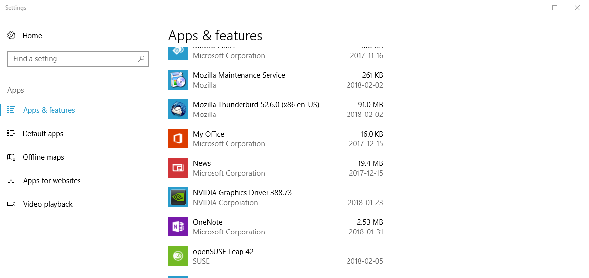
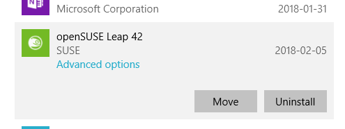
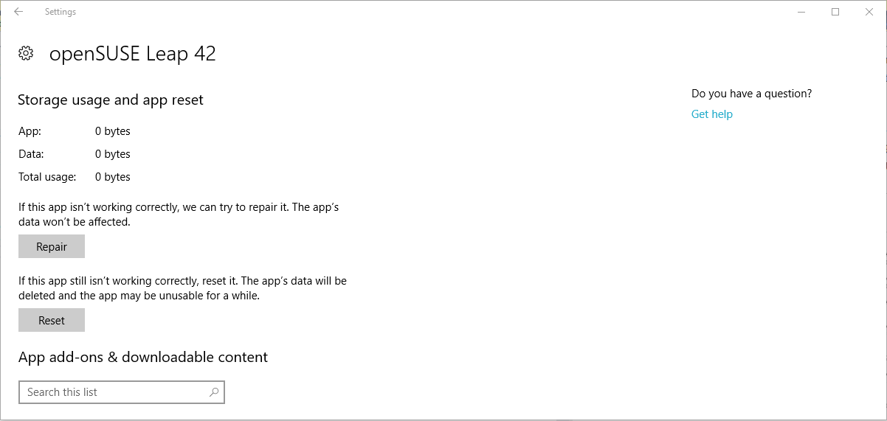
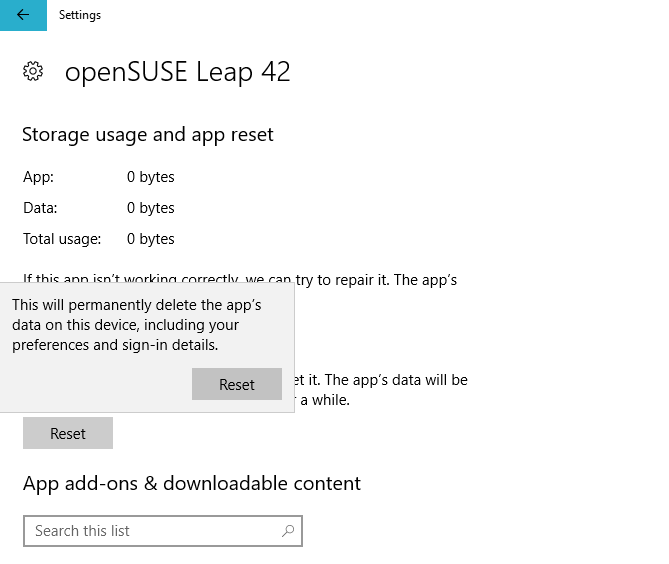

# Resetting Windows Store Distros
Any Linux distribution that was installed from the Windows Store
can be reset to the condition that the distribution was in
when downloaded from the Store. In other words, it is not
necessary to uninstall the distribution and then reinstall
it to return to a clean condition.

Note that performing this procedure removes all packages, data,
and configuration changes that you have made since you first
installed the distribution. This includes your user name and
password. If you have any data that you wish to keep, then
you should save the contents of the distribution before
proceeding.

Linux distributions are installed like any application. That is,
you will find the distribution listed on the Apps and Features
page of the Settings dialog. The image below shows the Apps and
Features page with OpenSUSE Leap 42 as the last app/feature on the
visible portion of the page:

In order to reset the distribution, click on it on this page. The
app entry expands:

Click on *Advanced options* to open the Storage usage and app
reset page:

Click on the *Reset* button. This will display a warning popup
message with another *Reset* button:

Read the warning and if you wish to proceed, click on the *Reset*
button in the popup. The popup will close and a wait symbol will
display to the right of the *Reset* button on the Storage usage and
app reset page. After a while (how long depends on how many packages
you have installed and updated, how many configuration changes you have
made, and how many data files you have created), the wait symbol will
change to a checkmark.

The reset is complete. When you start the distro again, it will install
and you will be asked for a user name and password.