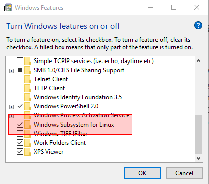
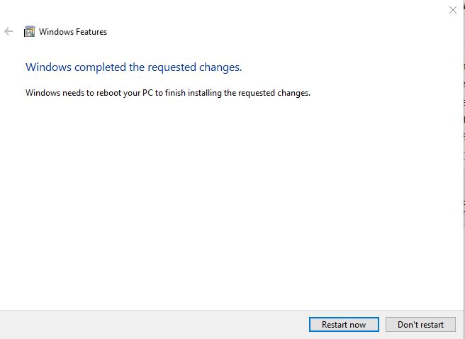

# Disabling Windows Subsystem for Linux

Just as there are two ways to enable WSL, there
are two ways to disable WSL. Both methods are
discussed below.

__Warning:__ You can disable WSL without uninstalling any Linux
distro. If you ever enable WSL again, your distros will probably still be
present. However, to be on the safe side, you should save your
data from each distro before disabling WSL.

## Using Powershell to Disable WSL
1. Execute Powershell as Administrator.
2. At the prompt, enter:
```
Disable-WindowsOptionalFeature -Online -FeatureName Microsoft-Windows-Subsystem-Linux
```

3. Restart your computer when requested.

## Using Windows Optional Features to Disable WSL
1. Press Win + R or click the right mouse button on the Windows menu
and select *Run*.d
1. Type *optionalfeatures.exe* and press Enter. This opens the Windows
features application. Scroll down to *Windows Subsystem for Linux* and
deselect it:

1. Click *OK*. This displays:

  Yes, it says that Windows needs to reboot to finish
**installing**, not *uninstalling*, but ignore that.
1. Click the *Restart now* button to restart your system.