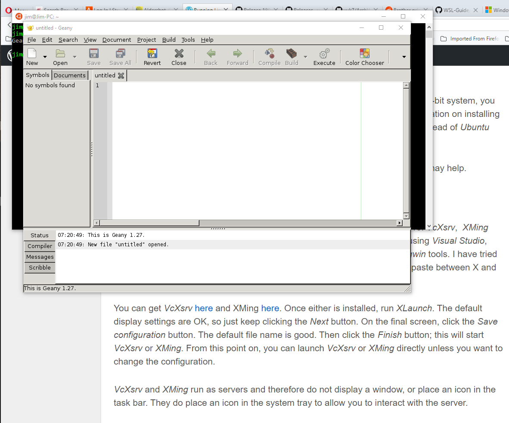

# Installing and Running a Linux GUI Application
The following instructions apply to Ubuntu on WSL; they
do not work with openSUSE or SLES. I have not tried them
on other distros such as Arch or Alpine.

## What Works, What Doesn't?
As mentioned earlier, many gtk+ based applications will
run, but most Qt based applications do not.

## Installing an Application
My favorite Linux text editor is *geany*, so I will be
providing instructions for installing it. *geany* is in
the Ubuntu package called *geany*. At the bash command
prompt, enter:
```
sudo apt install geany
```
When the installation is complete, enter:
```
geany
```
If you get:
```
Geany: cannot open display

```
then your X server is not running or you have not set up
the *DISPLAY* environment variable. See [X Server for Windows 10](
6010-Windows-X-Server.md).
Otherwise, *geany* will start and display its window:



*geany*'s icon is also placed in the Windows task bar.

## Running a GUI Application
At this point, you have installed everything you need to run your
application, and you have run it for the first time. So your day
is over and you have shut down your computer and restarted it the
next day. What do you need to do to run the application again?

1. Start *VcXsrv* or *XMing*.
1. Start *Ubuntu* from the Windows Start menu, or start *Ubuntu*
from *cmd.exe* or *Powershell*.
1. At the Ubuntu bash prompt, enter the name of your application,
with or without a trailing "&" to run the application in
background or foreground mode.

## References
1. The content of this page was copied, with a few modifications, from
[Running Linux GUI Apps on Windows 10](
https://jaipblog.wordpress.com/2018/01/21/running-linux-gui-apps-on-windows-10/).